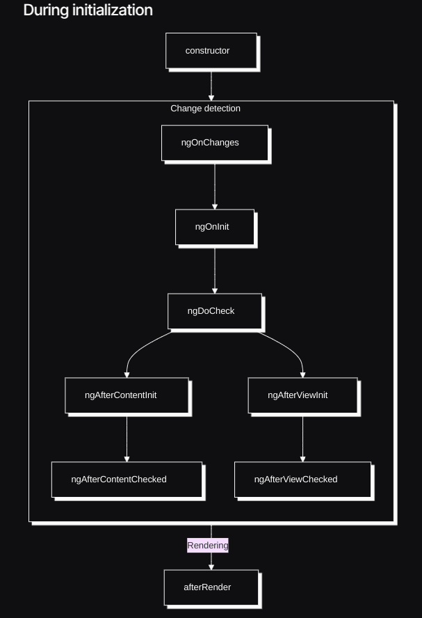
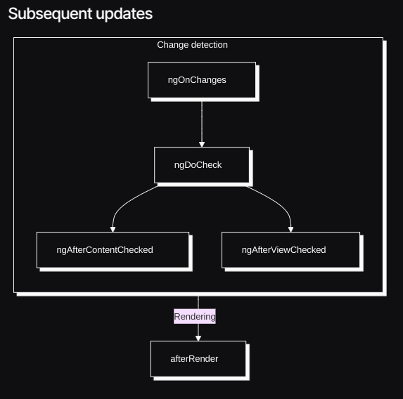

# What is angular?
* Angular is a frontend JS framework.

* It helps building interactive, modern web user interfaces.
* It's also a collection of tools and features (CLI, debugging tools, IDE plugin). 
<br><br>

# Why to use angular?
* ***Simplifies the process*** of building complex, interactive web user interfaces.

1. With angular ***you write declarative code***.
   * In simple terms, declarative code means you tell Angular what you want, and Angular takes care of how to do it.
   * Example: below you simply declare that the `<div>` should be shown if `isVisible` is true.
   * ***Angular takes care of updating the DOM when `isVisible` changes***.
```html
<div *ngIf="isVisible">Hello, World!</div>
```
2. Seperation of concerns via components.

3. Uses some OOP concepts & priciples.

4. Use Typescript.
<br><br>

> [!NOTE]
> Angular is stable framework.
> It is evolving framework.
> Has ***backward compatibility***.

<br><br>

# History
1st version > Angular JS. <br/>
2nd version > Angular 2 (released 2016).<br/>
.<br/>
.<br/>
.<br/>
Angular 14 (introduces standalone component).<br/>
Angular 16 (introduces signals).<br/>
<br/>

# Angular CLI
* The Angular CLI is a command-line interface tool which allows you to scaffold, develop, test, deploy, and maintain Angular applications directly from a command shell.

* To convert/compile angular code into code that runs into browser.
* To run angular project you need node and npm installed.
<br/><br/>

# How Angular Starts?

1. **Browser Loads `index.html` File**  
   - The `index.html` file is the main entry point that the browser initially loads when the application starts.

2. **Execution of `main.ts` File**  
   - The first code executed is in the `main.ts` file, which bootstraps the Angular application.

3. **Automatic Injection of Script Files**  
   - In `index.html`, you won’t see direct references to other `.js` files (like `main.ts`).  
   - However, when the app runs in the browser, those files are injected automatically by Angular CLI (in `<script>` tags) after building and running the application.
<br/><br/>

# Components
### Types of components based on how they are defined or used in Angular:
1. ***Module-Based Components***
   * Traditional components that are declared within an NgModule (e.g., in AppModule or a feature module).
   * These components rely on Angular’s module system to be used in other parts of the application.

   * Imported via modules rather than directly.
```ts
// Declaring a component in a module
@NgModule({
  declarations: [HelloComponent],
  imports: [],
  bootstrap: [AppComponent]
})
export class AppModule {}
```
2. ***Standalone Components***
   * Standalone components are self-contained and do not need to be declared in any NgModule.
   * They are directly imported and used wherever needed.

   * This simplifies module management and improves tree-shaking (removing unused code).
```ts
import { Component } from '@angular/core';

@Component({
  selector: 'app-hello',
  template: `<h1>Hello, Angular!</h1>`,
  standalone: true
})
export class HelloComponent {}
```

# index.html
```html
<body>
  <app-root></app-root><!-- This is important -->
</body>
</html>
```
* The `<app-root>` tag is where Angular loads the root component of the application.

* ***But how does Angular know what `<app-root>` refers to?***
<br/><br/>

# main.ts
```ts
1. import { bootstrapApplication } from '@angular/platform-browser';
2. import { appConfig } from './app/app.config';
3. import { AppComponent } from './app/app.component';

4. bootstrapApplication(AppComponent, appConfig)
  .catch((err) => console.error(err));
```
* In 3rd line we import `appcomponent`, and in 4th line we tell angular to load it in `index.html`.
* In line 3, we import the AppComponent, which contains the definition for` <app-root>`.
In line 4, we tell Angular to bootstrap (initialize) the `AppComponent`, which is then rendered inside `<app-root>` in `index.html`.
<br/><br/>

### What if we want to display another component along with or instead of `AppComponent`?
* You can import(line 4) the desired component into `main.ts` and bootstrap it(line 6).
```ts
1. import { bootstrapApplication } from '@angular/platform-browser';
2. import { appConfig } from './app/app.config';
3. import { AppComponent } from './app/app.component';
4. import { AnotherComponent } from './app/another.component';

5. bootstrapApplication(AppComponent, appConfig)
  .catch((err) => console.error(err));
6. bootstrapApplication(AnotherComponent, appConfig);
```

>[!IMPORTANT]
> Above `main.ts` code is valid only for `standalone components` (i.e. `AppComponent`, `AnotherComponent` should be `standalone components`).  
> For Modules, bootstraping angular app is described later in notes.

<br/><br/>

# Linking HTML Files or Markup in Standalone Components (Angular)
* using the ***`templateUrl`*** or ***`template`*** properties.
```ts
// 1: Linking an External HTML File.
@Component({
  standalone: true,
  templateUrl: './hello.component.html',
})

// 2: Using Inline HTML Template.
@Component({
  standalone: true,
  template: '<h1>Hello world</h1>',
})
```
<br/><br/>

# Linking CSS Files or styles in Standalone Components (Angular)
* using the ***`styles`*** or ***`styleUrl`*** or ***`styleUrls`*** properties.
```ts
// 1: Using Inline CSS style.
@Component({
  standalone: true,
  styles: [ 'h1 { color: blue; }' ]
})

// 2: Linking an External CSS File.
@Component({
  standalone: true,
  styleUrl: './single-style.component.css'
})

// 3: Linking multiples External CSS Files.
@Component({
  standalone: true,
  styleUrls: ['./multi-style1.component.css', './multi-style2.component.css']
})
```
<br/><br/>

# styles.css
* `styles.css` is a global stylesheet in an Angular project.

* It is automatically included by Angular CLI and applies styles globally across all components in the application unless overridden by component-specific styles.
<br/><br/>

# Binding template(HTML) with component
* Three ways:
1. <h3>String Interpolation</h3> 

   * Syntax: ***{{ public property from component }}***.

   * use in ***{{ }}***.
   * Used to directly display property values from the component inside the HTML.

2. <h3>Property binding & outputting computed values</h3>

   * Syntax: ***[property]="value"*** (where value is typically a property from the component).

   * The property to be set is wrapped in square brackets ***[ ]***.
3. <h3>Two way data binding.</h3>
```html
<div>
  <button>
    <!-- 1. String interpolation -->
    <span>{{ selectedUser.name }}</span>
    
    <!-- 2. Property binding -->
     
  
  </button>
</div>
```
<br/><br/>

#### Attribute Binding
* In Angular, when you use Property Binding, you're actually binding a property of a DOM element, ***not its HTML attribute***.
* For common properties like `src`, using property binding works perfectly because Angular can directly update the DOM property.
```html

```
* This binds the src property of the  DOM element to someSrc. Even though it looks like you're setting the src attribute, Angular is actually updating the DOM property.
* ***Sometimes, you need to set special attributes that don't have corresponding DOM properties. For example, ARIA attributes (used for accessibility) like aria-valuenow or aria-valuemax don’t have matching properties in the DOM.***

* If you try to use property binding for them, Angular won't find a matching DOM property, and it won't work as expected.

* Solution: `attr`. Binding
* Angular gives you a special way to bind attributes directly by using the attr. prefix. This tells Angular:
  * ***"Hey, I want to bind an HTML attribute, not a DOM property."***
```html
<div 
  [attr.aria-valuenow]="currentVal" 
  [attr.aria-valuemax]="maxVal">
</div>
```
<br/><br/>

# Using ***getters*** for computed values

* Use `get` keyword.
* Benifit: no need to call like method(imagePath<s>()</s>)
```ts
get imagePath() {
  return this.user.image;
}
```
```html

```
<br/><br/>

# Listening to Events with ***Event binding***
* In Angular, event binding allows you to listen for and respond to user events (like clicks, input changes, etc.) in your component's template using ***parentheses ()***.
```html
 <input (input)="onInputChange($event)" (blur)="onInputBlur()">
```
```ts
onInputChange(event: Event) {
    console.log('Input changed');
  }

  onInputBlur() {
    console.log('Input blur');
  }
```

> [!NOTE]
> Angular convention
> Those methods that are meant to execute on some event start with `on` as prefix (to make it clear that they are executed on event).

<br/><br/>

# UI state
* The ***current data or values used by your application*** that drive the rendering and behavior of the user interface (UI).

* Two approaches of updating state:
  1. Zone.js & change detection
  2. Signals
<br/><br/>

# 1. `Zone.js` in Angular
* ***It allows Angular to automatically detect and trigger change detection whenever an asynchronous event, such as a user interaction, HTTP request, or timer, completes***.

* Angular's change detection mechanism needs to know when to update the view. Instead of requiring developers to manually inform Angular about changes, Zone.js patches asynchronous APIs (like setTimeout, Promise, addEventListener, etc.) to monitor when these tasks start and finish. This way, Angular can automatically detect changes in the application state and update the DOM accordingly.
* ***Zone.js, zones(groups) components and whenever a state is updated it checks all component if they are affected***.
<br/><br/>

# 2. ***Signals*** in Angular (Introduced in Angular 16)
* A signal is an object that stores value.
* Signals are ***reactive***: Angular automatically tracks changes and updates only the affected parts of the UI.
```ts
// import signal function.
import { signal } from '@angular/core';

const x = signal(initialValue); // Optional initial value
```
* Changing signal values:
```ts
x.set(newValue);               // Directly sets a new value

x.update(value => value + 1); // Updates based on the current value
// in update callback, current value of signal is available.
```
* To read a signal's value, call it like a function:
```ts
x();
```
* ***How Angular Tracks Signals***:
  *  Where we read the value of signal that place is subscribed/register, and when signal is updated that place is reevaluated, rerendered and updated on the UI.
  * When you read a signal's value in a component or template (e.g., mySignal()), Angular registers a subscription to the signal.

  * If the signal's value changes, Angular reevaluates and updates only the places where the value is used.
* Angular manages subscription to the signal to get notified about the value change.
<table style="border-style: solid;">
<thead style="border-style: solid;">
<tr><td>Aspect</td><td>Zone.js</td><td>Signals</td></tr>
</thead><tboby>
<tr><td>Change Detection	</td><td>Checks all components for changes.</td><td>Updates only the places where signals are used.</td></tr>
<tr><td>Performance</td>
<td>May trigger unnecessary checks.</td>
<td>More efficient, updates specific parts of the UI.</td></tr>
<tr><td>Explicit Reactivity</td>
<td>Zone.js</td>
<td>Signals</td></tr>
<tr><td>Aspect</td>
<td>Implicit, tracked via zones.</td>
<td>Explicit, based on signal usage.</td></tr>
<tr><td></td><td></td>
<td>This eliminates the need for Zone.js to perform a global change detection cycle.</td></tr></tbody></table>
<br/><br/>

### Using signal for ***computed(calculated) values***
```ts
// import computed function.
import { signal, computed } from '@angular/core';
```
* It takes a function as an argument.
* It returns signal object.
```ts
x = signal(10); // Base signal
y = computed(() => this.x() * 2); // Computed signal
```
<br/><br/>

# ***Component Inputs*** (passing data from parent component to child component)
* You can pass data to component as ***attributes***.
* `@Input` decorator is used to define properties that a parent component can bind to when using the child component.
```ts
// example

```
* In the component.ts file which will receive this input, add ***@Input() decorator***.
```ts
@Input() x;

// in ts we need to specify type
@Input() x: string;

// also we need to initalize it
// but with `!` we can tell ts, that x will get initialized later some point in time or initialize in constructor.
@Input() x!: string;
```
### Static binding vs dynamic binding
<table border="1" style="border-collapse: collapse; text-align: left;">
  <thead>
    <tr>
      <th>Aspect</th>
      <th>&lt;app-user x="i"&gt;</th>
      <th>&lt;app-user [x]="i"&gt;</th>
    </tr>
  </thead>
  <tbody>
  <tr>
      <td>Syntax</td>
      <td><s>without []<s></td>
      <td>With []</td>
    </tr>
    <tr>
      <td>Type of Value</td>
      <td>Static string "i"</td>
      <td>Dynamic value from a variable <code>i</code></td>
    </tr>
    <tr>
      <td>Use Case</td>
      <td>When the value is fixed or constant.</td>
      <td>When the value comes from a variable or expression.</td>
    </tr>
  </tbody>
</table>

### @Input congifurations
```ts
  // This enforces that this attribute should compulsary to component.
  @Input({required: true}) avatar!: string;
  @Input({required: true}) name!: string;
```
```html
 <li>
    <!-- Here both atrributes should be compulsarily be passed -->
    <app-user [avatar]="users[0].avatar" [name]="users[0].name"/>
</li>
```
<br/><br/>

# To accept input as `Signal`
* Import `input` function.
* `input` > special function vs `Input` > decorator.
```ts
x = input();
x = input('default value');
x = input<string>();
x = input.required<string>(); // with required you cannot set default value.
```
* To make input as signal, ***we dont neccesarliy need to pass it signal object***.

* input signals are readonly, i.e. you can notcall set function on them and change there values.
* There values can only be changed if you pass different value to component form here ex:
```html
<app-user [x]="users[0].avatar" [y]="users[0].name"/>

<!-- OR -->

 <app-user [x]="users[1].avatar" [y]="users[1].name"/>
```
<br/><br/>

# ***Component Outputs*** (passing data from child component to parent component)
* You can send data from a component to its parent using `events`.
* The `@Output` decorator is used ***to define properties*** that a child component can ***emit as events*** for the parent component to listen to.
1. Create an Output Event in the Child Component:
   * Use the `@Output` decorator to define an event and an `EventEmitter` instance.
```ts
//child.ts
@Output() select = new EventEmitter();
```
1. Emit the value where & when you want:
```ts
//child.ts
this.select.emit(this.id);
```
1. Listen to the Emitted Value in the Parent Component:
```html
<!-- parent.html -->
<app-user (select)="onSelectUser($event)"/>
```
```ts
//parent.ts
onSelectUser(id: string) {
  console.log('selected user id :>> ', id);
}
```
* The `@Output` decorator defines a custom event that the child component can emit to its parent.
* The `EventEmitter` instance is used to trigger the event and pass data (e.g., `this.select.emit(this.id)`).
* The parent listens to the child component's event in its template using `(eventName)="handler($event)"`.

* ***The `$event` variable contains the value emitted by the child***.
* `$event` is available with both custom events(select) and built-in DOM events(click).
<br/><br/>

# output function
* Alternative of `@Output`.
* import `output` function.
```ts
//select = output();
select = output<string>();

onSelectUser() {
  this.select.emit(this.id);
}
```
* Here is implicitly creates `EventEmitter`.
* The `output` function is a simpler, more streamlined way to create event emitters in Angular, introduced in Angular 16. It implicitly creates an `EventEmitter` and reduces boilerplate.

* Benefits over @Output of output():
    1. Reduces syntax.
    2. if you use input() instead of <s>@Input</s> then it will look good if you dont use <s>@Output</s>.
    3. Forces ***Type Safety*** of emitted values.

* Forces ***Type Safety*** of emitted values.
```ts
// 1. output()
select = output<string>();

onSelectUser() {
  // emit function will only accept string value and will give error for other types.
  this.select.emit(this.id);
}


// 2. @Output
@Output() select = new EventEmitter();

onSelectUser() {
  // emit function will accept any type of value.
  this.select.emit(this.id);
}

// 3. To make @Output Typesafe
    // EventEmitter<string>()
@Output() select = new EventEmitter<string>();

onSelectUser() {
  // Now, emit function will only accept string value and will give error for other types.
  this.select.emit(this.id);
}
```
<br/><br/>

# Outputting list contents
### 1. @for
* From angular 17.
```html
@for (user of users; track user.id) {
      <li>
        <app-user
          [user]="user"
          (select)="onSelectUser($event)"
        />
      </li>
    }
```
* ***`track`*** (Angular’s trackBy mechanism)
  * Used with structural directives like `*ngFor` to ***optimize the rendering of lists*** by uniquely identifying each item in the list.

  * This is especially helpful when the list changes dynamically (e.g., adding, removing, or reordering items).
  * Without `track`, updating the list causes Angular to re-render all items in the list. However, with `track`, only the new or changed items are rendered, improving performance.

>[!TIP]
> To display something as fallback if the array in for loop is empty, can be done by `@empty`.
> ```html
> <ul>
>    @for (ticket of tickets; track ticket.id) {
>    <li>
>      <app-ticket />
>    </li>
>    } @empty {
>      <p>No tickets available.</p>
>    }
>  </ul>
> ```

<br/><br/>

### 2. *ngFor (structural directive)
1. `import { NgFor } from '@angular/common';`
2. `imports: [NgFor],`

```html
<li *ngFor="let user of users">
      <app-user [user]="user" (select)="onSelectUser($event)" />
    </li>
```

# Outputting condtional content
### 1. @if
* From angular 17.
```html
@if (selectedUser) {
    <app-tasks [name]="selectedUser ? selectedUser.name : ''"/>
   } @else {
    <p id="fallback">Select the user to see their task!</p>
   }
   <!-- you can also use: -->
   <!-- @else if () {} -->
```
<br/><br/>

### 2. *ngIf (structural directive)
* `import { NgIf } from '@angular/common';`
* `imports: [NgIf],`
```html
<app-tasks *ngIf="selectedUser; else fallback" [name]="selectedUser!.name" />
  <ng-template #fallback>
    <p id="fallback">Select the user to see their task!</p>
  </ng-template>
```
<br/><br/>

# Conditional class binding
```html
<button [class.active]="selected">button</button>
```
* `[class.active]`: This binds the active class to the button element conditionally.
* `selected`: This is a boolean property in the component's TypeScript class that determines whether the active class should be applied.
<br/><br/>

# Two-way-binding using directives (property + eventbinding)
* Combination of property and eventbinding.
### `ngModel`
* Used with form related elements(input, text area) to get access to the value entered by the user into those elements.
* `[(ngModel)]`: property[] + eventbinding().
1. Register the directive.
```ts
import { FormsModule } from '@angular/forms';

@Component({
  imports: [FormsModule],
})
export class NewComp {
    enteredTitle = '';
}
```
```html
<input type="text" id="title" name="title" [(ngModel)]="enteredTitle"/>
```
### Two way databinding using signals
```ts
import { signal } from '@angular/core';

export class NewComp {
    enteredTitle = signal('');
}
```
<br/><br/>

# FormsModule
* Form module is used to take control of `<form>` element.
* Hence it can be use to handle `form` submission on client side.
* To be notified when form submission occurs, `FormsModule` gives a special event that will be emitted i.e. `ngSubmit`.
* Now you can run your own code in response to submit event.

### `ngSubmit` event
* To be notified when form submission occurs.

### `ng-content` tag
* Used for ***content projection***.
* It allows you to project content from a parent component into a child component(content in between of child elements tag).
```html
<!-- parent.html -->
<app-child>
  <p>This is content.</p>
  <button>Click Me</button>
</app-child>
```
```html
<!-- child.html -->
<div>
  <!-- <ng-content></ng-content> OR-->
   <ng-content />
</div>
```
<br/><br/>

# Pipes
* Output transformers.
* Things that transform output in templates.
* Ex: if you want to show date in proper format.
```ts
import { DatePipe } from '@angular/common';

@Component({
  imports: [DatePipe],
})
```
```html
<time>{{ task.date | date }}</time>

<!-- o/p without pipe: 15-06-24 -->
<!-- o/p with pipe: Jun 15, 2024 -->
```
* We can change formatting by reading pipes documentation and adding extra properties.
```html
<time>{{ task.dueDate | date:'full' }}</time>
<!-- o/p: Wednesday, December 31, 2025 at 12:00:00 AM GMT+05:30 -->
```
<br/><br/>

# Service
* Performs some operation and/or manages data.
<br/><br/>

# Dependency injection
* `Service` is a `class` and `class` is a blueprint in order to use that `service` in other `class` we need `object` of it.

# Inappropriate approach
```ts
import {TasksService} from './task.service'

export class TasksComponent {
  private taskService = new TasksService();

  getTasks() {
    return this.taskService.getTasks();
  }
}
```
* ***Problem***:
  * If we want to use service in another components then we need to create seperate independent instance(object) of the service in that component.

  * We would not be sharing one common object. Due to this if we change data manage by that service in one component then those changes will not relflect in another component.

* ***Solution***: DI.
### Appropriate approach
* Use ***dependency injection***.
* Here we dont create instance on our own, but instead tell angular that we need such an instance and angular will create it.

* So angular will create one instance that we can use everywhere to operate on same data.

### 1. You need to register the service(class) as something injectable with Angular by `@Injectable()` decorator. So that Angular knows that it can be injected.
```ts
@Injectable({ providedIn: 'root' })
class TasksService() {
}
```
#### DI way 1: constructor
* You tell `Angular` which type of value you need and `Angular` creates it and ***provides it as an argument***.
```ts
  // 1. long cut:
  private taskService: TasksService;

  constructor(taskService: TasksService) {
    this.taskService = taskService;
  }

///////////////////////////////////////////////////

  // 2. short cut (by add private or public keyword)
  // This will automatically create property of same name.
  constructor(private taskService: TasksService) {
  }
```
#### DI way 2: inject() function
```ts
import { inject } from '@angular/core';

export class NewTaskComponent {
  private taskService = inject(TasksService);
}
```
<br/><br/>

# What is Angular `modules`?
* Angular modules make component (& more) available to each other.

* Famous on older versions of angular.
* Angular `modules`: here you ***don't specify at component level*** which components that component uses in its template.
* `Standalone component`: you specify at component level which components that component uses in its template.
<br><br>

### Creating module
* Create `root app module` next `root app component`.
* Add `@NgModule` over class.
* In declarations you declare & register `components` and `directives` that need to work together.

* `Standalone components` ***cannot be added*** in `NgModule declarations`.
```ts
import { NgModule } from '@angular/core'

@NgModule({
  declarations: []
})
export class AppModule {}
```

### main.ts
* Bootstraping Angular application with `module`.
```ts
import { platformBrowserDynamic} from '@angular/platform-browser-dynamic'
import { AppModule } from './app/app.module'

platformBrowserDynamic().bootstrapModule(AppModule);
```
* Also in AppModule specify root components you wanna set for your application in `bootstrap` array.
```ts
@NgModule({
  declarations: [AppComponent],
  bootstrap: [AppComponent]
})
export class AppModule {}
```
<br/><br/>

# Using `standalone components` in `Module`
* Decalare standalone components in `imports` array of `@NgModule`.
```ts
@NgModule({
  declarations: [AppComponent],
  bootstrap: [AppComponent],
  imports: [HeaderComponent, UserComponent, TasksComponent],
})
export class AppModule {}
```
>[!NOTE]
> `Imports` array is used for enabling standalone components.
>
> And ***also for including other modules***.
<br/><br/>

### BrowserModule
* Module provided by Angular that provides collection of things that are needed by every Angular application in order to run correctly.

>[!TIP]
> You can also add `Modules` to `standalone components`.
>
> e.x.: `imports: [FormsModule]`.

<br/><br/>

### Shared modules
* Break your application into multiple smaller modules and then combine them as needed.

* `exports`: In this array, we define modules that are not only required internally by the current module, but also those that should be made available to any other module that imports this module.
```ts
@NgModule({
  declarations: [CardComponent], // Declare components within the module
  exports: [CardComponent], // Export components to make them available to other modules that import this shared module
})
export class SharedModule {}
```
* When a module imports another module, it will only have access to the components, directives, and pipes that are explicitly listed in the exports array of the imported module.

* If a module needs something it must decalre or import it itself, it can't get it from any parent module that might be using this module.
* `BrowserModule` is meant to be imported in root module, for other modules you can import `CommonModule`.
<br/><br/>

>[!IMPORTANT]
> ### Public folder
> There’s no need to prepend the public/ directory when referencing assets. For example, instead of using:
>
> <s>img src="public/image.png"</s>
> 
> `img src="image.png"`
> 
> Angular automatically serves files from the src/assets or public folder, so you don’t need to specify the folder name in the path.

<br/><br/>

>[!NOTE]
>Value from form input will always be string.
<br/><br/>

>[!TIP]
> ## asReadonly() function
> To get ***read-only version*** of a `signal`.
>
> `results = this.investmentService.resultsData.asReadonly();`

<br/><br/>

# ***Source Maps*** for Debugging Logical Errors.
* The ***Sources tab*** allows you to analyze your Angular (TypeScript) code at runtime.
* You can add breakpoints.

* Your TypeScript code doesn't run directly in the browser. Instead, the code you write is `compiled` by `Angular CLI`, and it's the `compiled JavaScript` that is executed in the browser.
* `Source maps` are generated by `Angular CLI` during the build process. They allow the browser to map the executing code back to the original TypeScript source.
* In the Sources tab of Developer Tools, you can view the original TypeScript code (via source maps).
* To access this, go to Developer Tools > Sources.
<br/><br/>


# Splitting up components into smaller components
* Promotes S.O.C: Seperation of concerns.
* You can reuse that smaller component.

* Each component should only perform signle task.
<br/><br/>
<br/><br/>

# [***Component Selector***](https://angular.dev/guide/components/selectors)
There are two types of component selectors in Angular:
1. ***Element selector***.

2. ***Attribute selector***.
3. ***Class selector***.

## 1. Element selector
* An element selector ***defines a custom HTML element***, such as `<app-button>`, which Angular treats as a `component`.
```ts
@Component{
  selector: 'app-button',
}
```
```html
<app-button>
```
<br/><br/>

## 2. Attribute selector
* An attribute selector ***is used to apply a component to an element*** that has a specific attribute.

* When you add this attribute to an element, the component becomes active and would effectively replace it or take control of it.
```ts
@Component{
  selector: '[appButton]',
  // selector: 'button[appButton]',
  // selector: 'button[appButton], a[appButton]',
}
```
<br/><br/>

>[!IMPORTANT]
> We need to import our component in that component where we are using it.
> 
> Otherwise it will fail silently. 

<br/><br/>

## 3. Class selector
```ts
@Component{
  selector: '.button',
  //selector: 'button.button',
}
```
<br/><br/>

### Example of DOM Structure with Element Selector vs Attribute Selector
1. Using Element Selector:
   * Unnecessary wrapping over button element.
```html
<!-- HTML -->
<app-button>...</app-button>

<!-- DOM -->
 <app-button>
  <button>...</button>
</app-button>
```
2. Using Attribute Selector:
```html
<!-- HTML -->
<button appButton>...</button>


<!-- DOM -->
<button>...</button>
```
<br/><br/>

<table border="1">
  <tr>
  <th>Syntax</th>
    <th>selector: '[appButton]'</th>
    <th>selector: 'button[appButton]'</th>
    <th>selector: '.button'</th>
    <th>selector: 'button.button'</th>
  </tr>
  <tr>
    <th>Targets</th>
    <td>This selector applies to any element that has the appButton attribute, regardless of its tag type. It doesn't matter whether the element is a &lt;button&gt;, &lt;div&gt;, &lt;input&gt;, or any other HTML element. As long as it has the appButton attribute, the component will control it.</td>
    <td>This selector targets only &lt;button&gt; elements that also have the appButton attribute. It’s more specific than the previous one because it requires the element to be a &lt;button&lt; in addition to having the appButton attribute.</td>
    <td>It applies to any element with the button class, regardless of the element type.</td>
    <td>This selector targets only &lt;button&lt; elements that have the button class. It’s specific to the &lt;button&lt; tag and requires the element to have a particular class.</td>
  </tr>
  <tr>
    <th>Example</th>
    <td>
      &lt;button appButton&gt;Click me!&lt;/button&gt;<br/>
      &lt;input appButton value="Click me!" /&gt;<br/>
      &lt;div appButton&gt;Some text&lt;/div&gt;
    </td>
    <td>
      &lt;button appButton&gt;Click me!&lt;/button&gt;
    </td>
    <td> &lt;button class="button"&gt;Click me!&lt;/button&gt;<br/>
      <br/>
      &lt;div class="button"&gt;Click me!&lt;/div&gt;</td>
    <td>
      &lt;button class="button"&gt;Click me!&lt;/button&gt;
    </td>
  </tr>
</table>

<br/><br/>

# Supporting Content Projection with Multiple Slots
* In this scenario, the button component has a piece of content (the `Login` text) and an additional content element (the `→` arrow).

* The idea is to use content projection to insert these pieces of content into different slots in the component’s template.

### `select` attribute
* The `select` attribute in the `<ng-content>` element in Angular allows for ***content projection with specific conditions***.
* ***You can target specific elements from the parent template that match a CSS selector, and project them into specific slots inside the child component***.

```html
<button appButton>
    Login
  <span class="icon">→</span>
</button>
```
```html
<span>
  <ng-content />
</span>
 <ng-content select=".icon"/>
```
<br/><br/>

### `ngProjectAs`
```html
<button appButton>
    Login
  <span ngProjectAs="icon">→</span>
</button>
```
```html
<span>
  <ng-content />
</span>
 <ng-content select=".icon"/>
```
<br/><br/>

### Defining Fallbacks if Content Projection failed
* The content inside the `<ng-content>` tag can serve as a `fallback` if no matching content is found based on the specified `select` attribute.
```html
<ng-content select="icon">»</ng-content>
```
<br/><br/>

# View encapsulation
* Add ***encapsulation setting*** in `@Component` decorator.
```ts
import { ViewEncapsulation } from '@angular/core';

@Component({
  encapsulation: ViewEncapsulation.None,
})
```
* `encapsulation` takes value of type `ViewEncapsulation` enum.
```ts
enum ViewEncapsulation {
  Emulated = 0, // Angular emulates(copies) ShadowDom behavior.
  None = 2, // Diables styles encapsulation.
  ShadowDom = 3, // Here Angular uses original browser ShadowDOM feature.
}
```
* The Shadow DOM allows CSS styles to be scoped to a hidden DOM tree, ensuring styles apply only within that component and not globally.

* Angular can emulate(copy) this shadow DOM browser feature for its own components.
<br/><br/>

# Host elements
* Every angular component has a ***Host element***.

* For example, a component with the selector `app-header` targets the `<app-header>` element, which is rendered in the actual DOM.
* Like from template URL, take HTML and put it into the specifed selector.
```ts
@Component{
templateUrl: './abc.component.html', // Take html from here.
styleUrl: './abc.component.css' // Take css from here.


// Put html & css from above into below selector.

selector: 'app-abc',
// i.e put it inside <app-abc></app-abc>
}
```
* Now the css in `./abc.component.css` is applied to `./abc.component.html` but ***not to other elements*** in `<app-abc></app-abc>`.
* To apply styles to them use `:host` in `./abc.component.css`.
>[!IMPORTANT]
> The element targeted by your component's selector is not replaced when the page is rendered. It’s not a placeholder.
> 
> Instead, the selected elements are preserved and simply "***enhanced***"/"taken over" by your component logic & markup!
* The ***host element*** is ***not part of the component's template***, but it will still be affected by scoped styles through the `:host` selector.
>[!NOTE]
> `:host` behavior is a CSS feature, not an Angular-specific feature.
### Example of ***Styling the Host Element***
```html
<!-- earlier -->
 <!-- button {
  display: inline-block;
  padding: 0.65rem 1.35rem;
  border-radius: 0.25rem;
}

button:hover {
  background-color: #551b98;
} -->
<!-- after -->
:host {
  display: inline-block;
  padding: 0.65rem 1.35rem;
  border-radius: 0.25rem;
}

:host:hover {
  background-color: #551b98;
}
```
# Usecase
* Let's say we want to create a custom button component in Angular.
```ts
// buttonComponent.ts
import { Component } from '@angular/core';

@Component({
  selector: 'button[appButton]', // This targets <button appButton></button>
  standalone: true,
  templateUrl: './button.component.html',
  styleUrl: './button.component.css'
})
export class ButtonComponent {
}
```
```html
<!-- button.component.html -->
<span>
  <ng-content />
</span>
 <ng-content select="icon">»</ng-content>
```
```css
/* button.component.css */
button {
  display: inline-block;
  padding: 0.65rem 1.35rem;
  border-radius: 0.25rem;
}

button:hover {
  background-color: #551b98;
}
```
#### Now we can use our custom button component in the app:
* 
```html
<!-- html where custom buttom component is used. -->
<button appButton>
  Submit
  <span ngProjectAs="icon">»</span>
</button>
```
#### The Issue with Styles
* We added styles to the `<button>` element inside the component, but in the `button.component.html`, we don't actually have a `<button>` tag. Instead, the host element is the `<button>` tag itself, and the styles won't be applied directly to it.

### Solution: Use `:host` to Style the Host Element
* To apply styles to the host element (the `<button>` in this case), we can use the `:host` selector in the component's CSS:
```css
/* button.component.css */
:host {
  display: inline-block;
  padding: 0.65rem 1.35rem;
  border-radius: 0.25rem;
}

:host:hover {
  background-color: #551b98;
}
```
* Now the styles will correctly apply to the `<button>` tag used in the template!
<br/><br/>

## Interacting With Host Elements From Inside Components
### Method 1
* `host` setting in `@Component` decorator.

* It takes key-value pairs as properties on your host element.
```ts
@Component({
  selector: 'app-abc',
  host: {
    class: 'control',
  },
})
```
* This will add class attribute to `app-abc` wherever its being used.
<br/><br/>

### Method 2 (old approach, not prefered)
* You can add a property to your component class and set the value you want to bind on your host element and decorate it with the `@HostBinding()` decorator.
```ts
export class ControlComponent {
  // @HostBinding() className = 'control';
  @HostBinding('class') className = 'control';
}
```
<br/><br/>

## To listen to an event on host element
  * To bind a method to an event to which you wanna listen here.
  * Usecase: (ex: when host element is clicked).
#### Way 1: using `host` setting in `@Component` decorator.
```ts
@Component({
  encapsulation: ViewEncapsulation.None,
  host: {
    '(click)': 'onClick()'
  },
})
export class ControlComponent {

  onClick() {
    console.log('clicked');
  }
}
```
<br/><br/>

#### Way 2: ***@HostListener()*** decorator
```ts
@Component({
})
export class ControlComponent {

// pass event name to decorator as argument.
  @HostListener('click') onClick() {
    console.log('clicked');
  }
}
```
<br/><br/>

# Interacting with Host Elements Programmatically

* The special class name is `ElementRef`.

* `ElementRef` is a class provided by Angular that allows you to reference an element rendered on the page.
* It can reference any element on the page.
* By ***injecting `ElementRef` into a component***, Angular provides ***access to the host element of that component***.

```typescript
import { Component, ElementRef, OnInit } from '@angular/core';

@Component({
  selector: 'app-example',
  template: `<div>Hello, Angular!</div>`,
  styles: [`
    div {
      color: blue;
      font-size: 20px;
    }
  `]
})
export class ExampleComponent implements OnInit {

  constructor(private elementRef: ElementRef) {}

  ngOnInit() {
    // Accessing the host element
    const hostElement = this.elementRef.nativeElement;
    // Changing the background color of the host element
    hostElement.style.backgroundColor = 'yellow';
    console.log(hostElement);
  }
}
```
<br/><br/>

# Advanced class binding
* Syntax to dynamically control ***multiple css classes*** simultaneously.

* Set class value to object that contain multiple key-value pairs where every key represents one css class and its value should be boolean.
```html
<div [class]="{
  status: true,
  'status-online': currentStatus === 'online',
  'status-offline': currentStatus === 'offline',
  'status-unknown': currentStatus === 'unknown',
}">
test.
</div>
```

>[!NOTE]
> In JS and TS.
> 
> You can not add properties that includes dashes(-) or white spaces( ) to a an object. e.x object = { (e.g., my-class: 'abc' )}
>
> If you want to use them in object use then in single quotes e.x object = { (e.g., 'my-class': 'abc' )}.

<br/><br/>

# Binding CSS styles dynamically.
* Dynamic Inline Style Binding.

* Use `style` keyword property.
```html
<div
[style.fontSize]="'64px'"
>
</div>
```
* Multiple styles
```html
<div
  [style]="{
    'font-size': '64px',
    'backgroundColor': 'lightblue',
  }"
>
</div>
```

>[!TIP]
> You can use camelCase synatax also like ***'fontSize':'64px'***, to aviod dashes(-) and white spaces( ), or using quotes.

<br/><br/>

# Component Lifecycle: 
* All components in Angular goes through `component life cycle`.

* When Angular instantiates and renders a component and when it checks it for changes in future, certain life cycle hooks are triggered by Angular.

>[!NOTE]
> There can be a typo in method names like (ngoninit), then Angular will not consider it as Component Lifecycle method.
>
> Solution: Implement `Interfaces` provide by Angular like `OnInit`, which will force to implement proper method.
>
> With implementing interface, Component Lifecycle methods will work proper but there should be no typo in method name.

<br/><br/>

### Execution order of Angular's lifecycle hooks.

<br/><br/>




<br/><br/>

# `ngOnInit`
* Runs once after Angular has initialized all the component's inputs.

* In Angular it is recommended to use `ngOnInit` instead of `constructor`.

>[!TIP]
> Keep `constructor` lean and only do basic class initalization in `constructor` (like setting initial class property values).
>
> Use `ngOnInit` for more complex tasks and initalization work.
>
> Like sending HTTP requests.

>[!IMPORTANT]
> If your component receives any `input` values, those values will be initialized and will be available in `ngOnInit`.
>
> Whereas not in `constructor`.

<br/><br/>

# `ngDoCheck`
* It is related to Angular ***change detection mechanism***.
* It is invoked whenever Angular thinks that a UI update might be needed.

* So whenever Angular detects anything anywhere ***on the entire application*** (not just in component but entire application), then this hook gets invoked.
* ***Hence this hook is invoked a lot, so its discouraged to use, as any code inside it will run a lot***.
<br/><br/>

## Difference betweem `view` & `content`.
<table border="1">
  <tr>
    <th>Syntax</th>
    <th>VIEW</th>
    <th>CONTENT</th>
  </tr>
  <tr>
    <th></th>
    <td>`View` of an Angular component is its template (HTML).</td>
    <td>Any content that might be projected into view with `ngContent`.</td>
  </tr>
  <tr>
    <th>Technically</th>
    <td>`View` is an internally managed data structure that holds reference to the DOM elements rendered by a component.</td>
    <td>`Content` is some other (partial) View data structure projected into this component's View.</td>
  </tr>
</table>
<br/><br/>

# `ngAfterContentInit`
* Executed after any projected content is initialized.
<br/><br/>

# `ngAfterContentChecked`
* Executed whenever the content has been checked by Angular's change detection mechanism.
<br/><br/>

# `ngAfterViewInit`
* Executed after any projected content is initialized + all other elements in the template (i.e view) is initialized.
<br/><br/>

# `ngAfterViewChecked`
* Executed whenever the content + view(template) of this component has been checked by Angular's change detection mechanism.
<br/><br/>

# `ngOnDestroy`
* To do cleanup work right before the component is gone.
<br/><br/>

# `DestroyRef`
* Modern alternative of `ngOnDestroy`.
* Works Angular v16+.

* In Angular, you can now use a ***special service*** called `DestroyRef`, which allows you to handle cleanup operations when a component is about to be destroyed.
  1. You inject DestroyRef into your component (either through the constructor or directly).

  2. By injecting `DestroyRef` and storing it in a property, you can setup a listener with help of this property.
  3. The inject value will trigger a function whenever the function into which you injected DestroyRef is about to be destroyed.
```ts
// also you can inject in constructor.
private destroyRef = inject(DestroyRef);

method() {
    const interval = setInterval(() => {
     // some logic
    }, 5000);

    // In this.destroyRef.onDestroy() we register a function that will be executed by angular when this component is about to be destroyed.
    this.destroyRef.onDestroy(() => {
      clearInterval(interval)
    })
  }
```
<br/><br/>

# Template Variable
* (Alternative of `ngModel` but, here instead of storing a literal value, you can ***store reference to a whole element*** from template, in a so-called ***template variable***.)
* Angular feature.
### Steps to Use Template Variables:
1. ***Add a special attribute*** to the element where you want to store a reference. This attribute ***starts with a hash (#)*** to create a template variable.
```html
    <input name="title" id="title" #titleInput />
```
* In the above example, titleInput is a template variable that stores the reference to the `<input>` element.
2. ***Access the template variable*** in the rest of the template without the hash symbol.
```html
<!-- onSubmit(titleInput) -->
<form (ngSubmit)="onSubmit(titleInput)">
  <app-control label="Title">
    <input name="title" id="title" #titleInput />
  </app-control>
</form>
```
<br/>

>[!TIP]
> You can see `type` of the template variable, by hovering over it html template file.

>[!NOTE]
> Unlike `ngModel`, the template variable doesn't update its value on every keystroke. It's more efficient.
* Instead of passing whole reference of element you can also pass specific feilds from it.
```html
<!-- titleInput.value. -->
<form (ngSubmit)="onSubmit(titleInput.value)">
  <app-control label="Title">
    <input name="title" id="title" #titleInput />
  </app-control>
</form>
```
* In this example, you are only passing the value of titleInput instead of the entire reference.

<br/>

### Template Variables & Component Instances
>[!IMPORTANT]
> When you try to assign ***a reference of Angular component*** to `template variable` it does not give access to DOM element, but instead gives access to ***instance of that component***.
> ```html
> <!-- .html file. -->
> <app-control label="Request" #angularComponent>
>  </app-control>
>
>  <example (click)="onClick(angularComponent.contolMethod())">
> <!--<example (click)="onClick(angularComponent.variable)"> -->
> ```
> ```ts
> // .ts file.
> export class ControlComponent {
> variable: string;
> contolMethod() {
>     console.log('clicked');
>   }
> } 
>```

<br/><br/>

# Accessing `Template Variable` directly in component.ts file.
# `ViewChild()` decorator
* The `@ViewChild()` decorator in Angular is used to get a ***reference*** to any child element, directive, or component inside a template.
* By doing this, you can interact with these elements or components directly in the component class.
### Steps to use @ViewChild():
* ***Passing a selector***: You pass a selector to the `@ViewChild()` decorator. This can be:
   1. The class of a component (if you want to access a component).
```ts
@ViewChild(ControlComponent) cComp?: ControlComponent;

cComp.anyMethodOrVarFromControlComponent;
```

   2. A template reference variable (a string that identifies an element in your template).
```HTML
<form #form>
  <!-- form content here -->
</form>
```
```ts
@ViewChild('form') form?: ElementRef<HTMLFormElement>;


// use nativeElement here because we store element inside ElementRef wrapper object.
ngAfterViewInit() {
  this.form?.nativeElement.reset(); // Access and reset the form
}
```
   3. A directive class name (to access an instance of the directive applied to an element).
* ***Using the reference***: After the component or element is captured by @ViewChild(), you can access its properties and methods.

<br/>

>[!TIP]
> ### Using `ngAfterViewInit` for Safe Access.
> Since `ViewChild` works ***after the view has been initialized***, you generally want to access your `ViewChild` `references` in the `ngAfterViewInit()` ***lifecycle hook***, which guarantees that the DOM has been rendered and the child elements are accessible.

<br/><br/>

# `ViewChildren()`
* To select ***multiple*** elements or components within a view.

* It ***returns an Array*** (or QueryList) of references.
```html
<form #form1>
  <input type="text" />
  <button>Submit</button>
</form>

<form #form2>
  <input type="text" />
  <button>Submit</button>
</form>
```
```ts
  @ViewChildren('form1, form2') forms?: QueryList<ElementRef<HTMLFormElement>>;

  ngAfterViewInit() {
    // Iterate over the forms
    this.forms?.forEach(form => {
      form.nativeElement.reset(); // Reset each form
    });


// Using @ViewChildren with Components.
  @ViewChildren(ChildComponent) children?: QueryList<ChildComponent>;
```

<br/><br/>

# `viewChild()` function
* From Angular 17.3+.
* It will return `signal`.
* Also you can use `viewChildren()` function to get multiple references from view(template).
```ts
// 1. For component
  private cComp = viewChild(ControlComponent);

// 2. For element in view(template)
// pass Template Variable.
  private form = viewChild('form');
```
<br/><br/>

>[!IMPORTANT]
> ***When you use `ngContent` to project content into template, then the projected content is not actually the part to template(view).***
> * Hence you ***cannot get*** reference of projected content with `ViewChild`.
> 
> * You can get it with ***`ContentChild`***.

# `ContentChild` & `ContentChildren` decorators
* You can use `contentChild()` & `contentChildren()` function to get signal.

>[!TIP]
> ### Using `ngAfterContentInit` for Safe Access.
> Since `ContentChild` works ***after the content has been initialized***, you generally want to access your `ContentChild` `references` in the `ngAfterContentInit()` ***lifecycle hook***, which guarantees that the DOM has been rendered and projected content is accessible.

<br/><br/>

# `afterRender` & `afterNextRender` lifecycle hooks.
* Angular 16+.
* You need to ***register them with the help of constructor*** (and not as methods in class).
```ts
constructor() {
    afterRender(() => {
      console.log('afterRender');
    });

    afterNextRender(() => {
      console.log('afterNextRender');
    });
  }
``` 
### `afterRender`
* It allow to define function to execute, whenever anything in entire application changes.
* After every change detection cycle that follows.

### `afterNextRender`
* Once after the next change detection cycle.

<br/><br/>

>[!NOTE]
>`afterRender` & `afterNextRender` lifecycle hooks refers to entire Angular application.
>
> Whereas other lifecycle hooks refers only to a specific component.

<br/><br/>

# `effect()` function
* Lifecycle hook cum signal feature.
* Allows to run code when signal values change.
* It takes function as an argument.
* You can use this function to set subscription to signals where Angular does not sets subscription.
* The ***function passed into*** `effect()` will be executed automatically whenever the `signal` values used inside that function change.
* When the component that is using the `effect()` is removed from the DOM, Angular automatically cleans up any subscriptions related to that `effect()`. This avoids memory leaks, making it easier to manage signals in Angular.
```ts
effect(() => {
      console.log('this.currentStatus() :>> ', this.currentStatus());
})
```

<br/>

## Signal Effects Cleanup Functions
* When working with Signal effects, you sometimes might need to perform some cleanup work before the effect function runs again (e.g., to clear some timer or something like that).

* Angular's `effect()` allows you to do that!

* It does provide you with an onCleanup hook which you can execute as part of your effect function to define what should happen before the effect code runs the next time:
```ts
effect((onCleanup) => {
  const tasks = getTasks();
  const timer = setTimeout(() => {
    console.log(`Current number of tasks: ${tasks().length}`);
  }, 1000);
  onCleanup(() => {
    clearTimeout(timer);
  });
});
```

<br/><br/>

# `@for` deep dive
* Angular give some special variables that you use within ***@for*** loop.
* e.g.: first, last, even, odd.
* count
```html
<ul>
    @for (ticket of tickets; track ticket.id) {
    <li><app-ticket /> = {{ $first }}</li>
    } @empty {
    <p>No tickets available.</p>
    }
</ul>
```

<br/><br/>

# Configuring Component Inputs & Outputs, decorator and signals.
* alias (i.e., use with different name).

* transform. 
  * Transform the data passed via inputs or outputs (e.g., format or modify data before using it).
  * Like changing dataType.

* required.
```ts
@Input({ configuration })

data = input.required<Ticket>({ configuration });
```

<br/><br/>

# Custom two-way data binding
* In Angular, custom two-way data binding can be implemented by using a combination of the @Input() and @Output() decorators.

* Angular requires that custom `@Output()` event names for two-way binding follow a specific naming convention: the `@Output()` event should have the name of the` @Input()` property with the Change suffix.
```ts
// RectComponent.ts
export class RectComponent {
  // Todo: Implement custom two-way binding
  @Input({ required: true }) size!: { width: string; height: string };
  @Output() sizeChange = new EventEmitter<{ width: string; height: string }>();

  onReset() {
    this.sizeChange.emit({
      width: '200',
      height: '100',
    });
  }
}
```
```html
<!-- RectComponent.html -->
<div
  id="rect"
  [style.width]="size.width + 'px'"
  [style.height]="size.height + 'px'"
  (click)="onReset()"
></div>
```
```html
<!-- AppComponent.html -->
<app-rect [(size)]="rectSize" />
```
```ts
// AppComponent.ts
export class AppComponent {
  rectSize = {
    width: '100',
    height: '100',
  };
}
```

<br/><br/>

# model() function for two-way data binding
* Easier syntax.


<br/><br/>

# What is a <span style=color:Green>***Directive***</span> in Angular?
* To add extra functionality to elements.
* Similar to Components(component have templates(html) but directives dont).
* Components are directives with template.
* In Angular, a ***directive*** is a <span style=color:red>***class***</span> that allows you to <span style=color:gold>***manipulate the DOM (Document Object Model) or change the behavior of elements***</span> in the user interface (UI).

* The directive class uses a special decorator, <span style=color:Pink>***@Directive***</span>, to tell Angular that it’s a directive.

## Types of Directives in Angular
There are three main types of directives in Angular:

1. Structural Directives (like *ngIf, *ngFor)
2. Attribute Directives (like ngClass, ngStyle)
3. Component Directives (which are also a special kind of directive)

### 1. ***Structural*** Directives
* These directives <span style=color:gold>***change the***</span> <span style=color:red>***structure***</span> <span style=color:gold>***of the DOM***</span>.

* They can add or remove elements from the DOM based on certain conditions.

* Example: *ngIf, *ngFor
```html
<div *ngIf="isVisible">This content is visible when 'isVisible' is true.</div>
```
<hr><br>

### 2. Attribute Directives
* These directives <span style=color:gold>***change the***</span> <span style=color:red>***appearance or behavior***</span> <span style=color:gold>***of an existing DOM element***</span>. Unlike structural directives, they don't add or remove elements from the DOM, but instead modify the element they are attached to.

* Example: ngClass, ngStyle, mat-card-title

```html
<div [ngClass]="{ 'highlight': isHighlighted }">This div is highlighted if 'isHighlighted' is true.</div>

<div [ngStyle]="{ 'background-color': backgroundColor }">This div has a dynamic background color.</div>

<div mat-card-title>Card Title</div>
```
<hr><br>

### 3. Component Directives
* Technically, components in Angular are also a type of directive. Components are the most common kind of directive you'll work with. They include both the structure (HTML) and behavior (logic) for a part of your app.

* Example: <app-header>, <app-footer>
<hr><br>

### You can create your custom directive to manipulate DOM as per your requirement.
<hr>

#### Common Use Cases for Directives
  * Conditionally Render DOM Elements:

  * Apply Styles Dynamically:
  * Event Handling:
  * Create Reusable UI Elements:
  * Material Design Elements:
<hr><br><br>

# What is <span style=color:Pink>***providers***</span> in Angular?

<hr><br><br>

# What is <span style=color:Pink>***change detection***</span> in Angular?

* In Angular, change detection is the mechanism by which Angular <span style=color:gold>***determines when to update the view***</span> in response to ***changes in the application state*** (e.g., changes to component properties, events, or external data).
* The ChangeDetectionStrategy determines how Angular ***checks for these changes*** and updates the view accordingly.

* By default, Angular uses the `ChangeDetectionStrategy.Default` strategy, which checks the entire component tree for changes every time an event is triggered (such as a click or user input).

2. `ChangeDetectionStrategy.OnPush`
   * The OnPush change detection strategy is a performance optimization technique that tells Angular to only check for changes ***when certain conditions are met***.
   * When is it checked?
     * When one of its ***@Input() properties changes***.
     * When an ***event is triggered*** from the component (such as an emitted event).
     * If ***markForCheck()*** is called.

```ts
//syntax
import { ChangeDetectionStrategy } from '@angular/core';

@Component({
  changeDetection: ChangeDetectionStrategy.OnPush,
})
```
